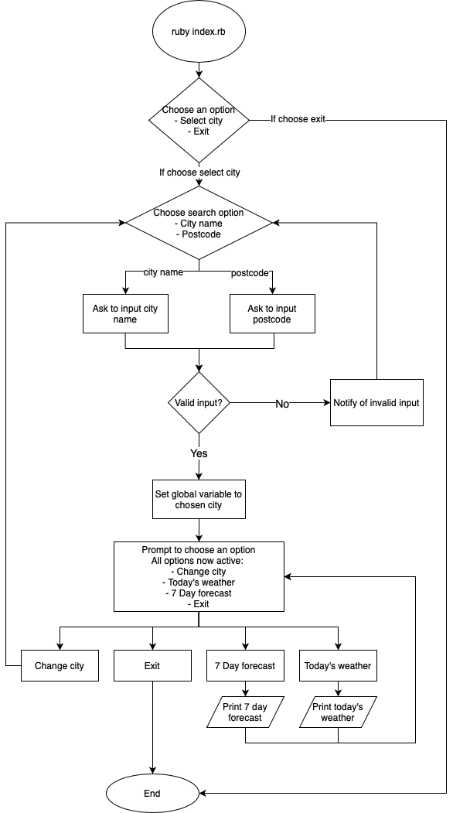
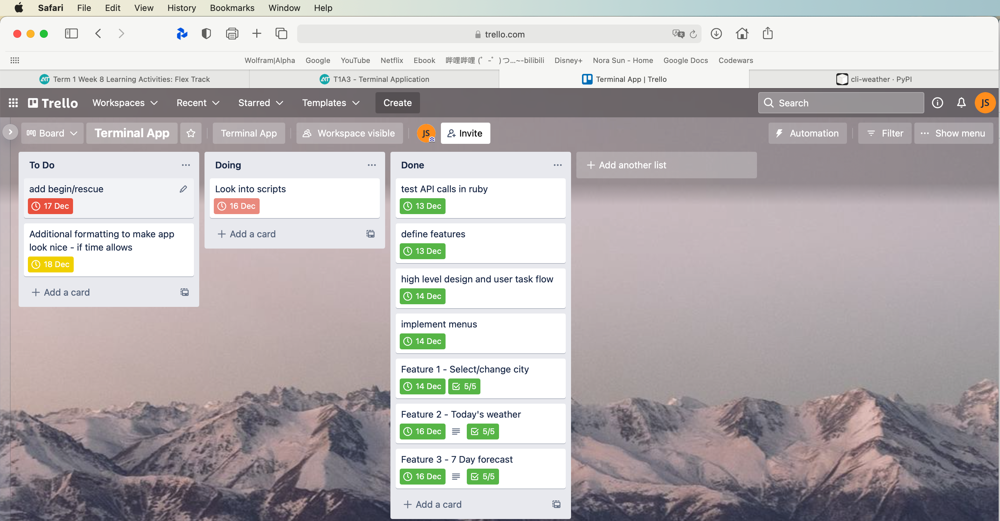
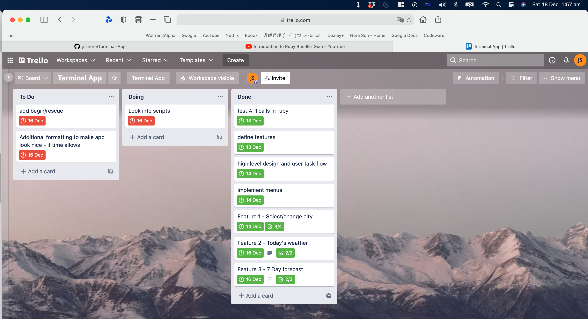
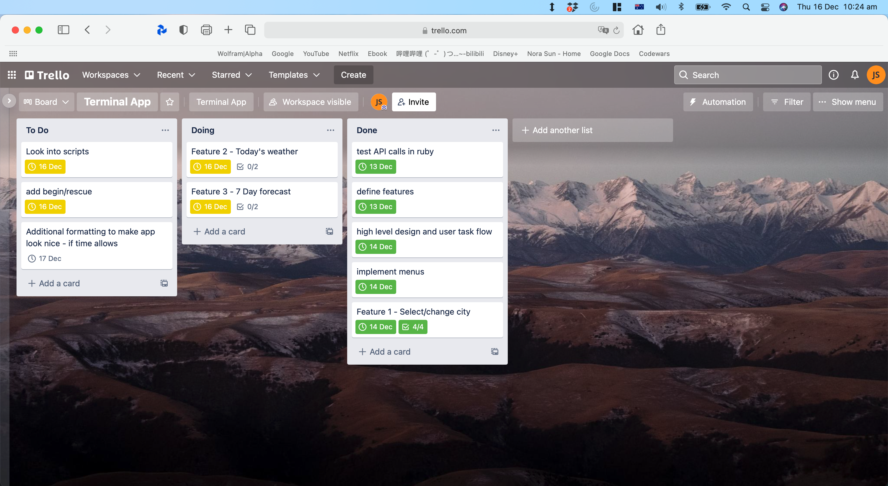

# T1A3 - Terminal Weather App

## Develop a statement of purpose and scope for your application. It must include:

### Describe at a high level what the application will do
The application is a simple CLI application that allows the user to view today's weather or a 7 day forecast of their selected Australian city. There are two options to seach for the desired city - via input of city name or a valid Australian postcode. Once the user select a city, the program will fetch weather data from https://openweathermap.org/api via API calls and format the response and display weather information on the user's terminal.
### Identify the problem it will solve and explain why you are developing it
There lot's of websites and mobile apps that allow you to check the weather, but close to none CLI weather apps. As such, I have developed this application users can get weather data on the terminal.
### Identify the target audience 
The target audience for this application would be people who want to check the weather on the terminal.
### Explain how a member of the target audience will use it
The application is simple and straight forward. The user just need to follow the prompts after launching the application. The menu options can be navigated by using the arrow keys on the keyboard. The user will be asked to select a city, the city can be found by either city name or postcode. Once a city is selected, the user can go through the menu and choose to view either today's weather or a 7 day forecast for the selected city.

## Develop a list of features that will be included in the application.
### Select / Change Location
This allows the user to select the location for which the weather data will be retrieved. The user must first select a city to be able to use the forecasting options. The user can select to either search by city name, or by postcode. After choosing the relevant option and searching for a city, if no error occurs, the user will be taken back to the main menu.
### Today's Weather
This provides today's weather details for the chosen location. The user selects this option, and the table containing the relevant information is printed. This option contains details on the date, condition (e.g. partly cloudy, light rain clear, sky etc), maximum temperature, mininum temperature, 'feels like' temperature, change of rain (%), UV index, wind speed, humidity, and sunrise/sunset time.
### 7 Day Forecast
This provides weather details for the chosen location for today, plus 7 days in advance. The user selects this option, and the table containing the relevant information is printed. This option contains details on the date, condition (e.g. partly cloudy, light rain clear, sky etc), maximum temperature, mininum temperature, and change of rain.

## Develop an outline of the user interaction and experience for the application.
The user will interact with all menus (main menu, search option within change city feature) through the use of a visual selector implemented with the tty-prompt gem. The user uses the arrow keys to move the selector up or down, and then presses the enter/return key to select the currently highlighted option. This is a simpler and less error prone method of input and navigation compared to asking the user to input freeform text to select a menu option.

Once the city is set, there is no interaction required to use the 'todays weather' and '7 day forecast' features other than selecting them from the main menu using the arrow keys and enter key as previously detailed. The main menu automatically prints after displaying the relevant data, the user does not have to press anything to go back to the main menu as even a small terminal window can accommodate the small size of the table plus the menu. These features are not accessible if the city is not set, thereby eliminating the potential for an invalid API call when retrieving and printing the weather data.

The select / change city feature once again is selected using the menu navigation described above, as does the sub menu that is displayed to the user. Within the sub-menu the user chooses if they want to search by postcode or city name. Once this is selected, the user is prompted to enter a postcode or city name in the form of freeform text. Through the tty-prompt gem however I have implemented validation to ensure that the postcode is only numbers. There is then additional validation which checks the validity of the city/postcode with the API before allowing the user to continue. At this stage there may be errors in the city name or postcode, which will be output to the user as a message providing feedback on what went wrong and prompting them to try the action again.

## Develop a diagram which describes the control flow of your application

## Develop an implementation plan

For this I used trello, adding due dates and checklists to tasks and features, regularly adding to this as the plan/path for developing each feature became clearer. This available at the following link.

https://trello.com/b/5MmBXW9A/terminal-app

## Help / Installation

